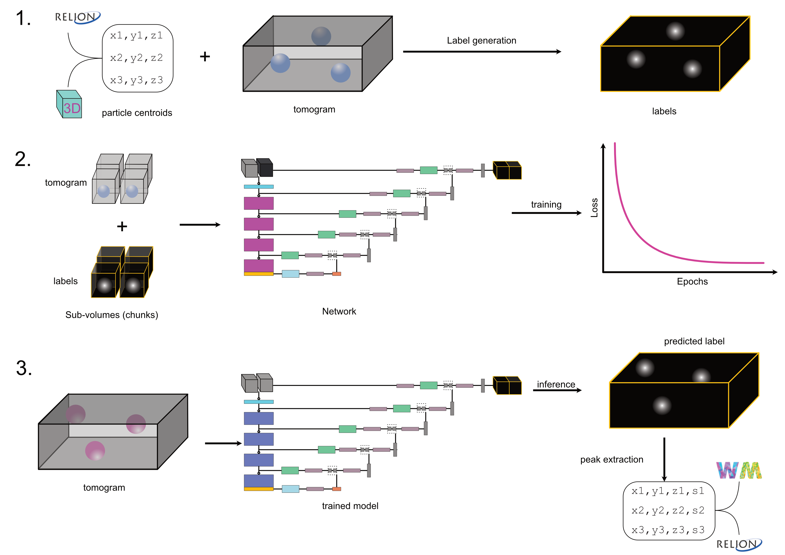

### tomoCPT (tomogram Centroid Prediction Tool) is a deep learning based program for enabling centroid prediction of objects in 3D cryo-tomograms.

# Installation
1. Clone the repository in a user writable location
```
git clone https://github.com/shahpnmlab/tomocpt
```
2. ```cd tomocpt```

3. Create a virtual environment to install tomocpt into
```
conda create -n tomocpt python=3.10
conda activate tomocpt
pip install -e .
```
4. Check if things are working by running
```
tomocpt --help
```
You should see the following output
```
 Usage: tomocpt [OPTIONS] COMMAND [ARGS]...                                                                                                                                                
                                                                                                                                                                                           
╭─ Options ───────────────────────────────────────────────────────────────────────────────────────────────────────────────────────────────────────────────────────────────────────────────╮
│ --help          Show this message and exit.                                                                                                                                             │
╰─────────────────────────────────────────────────────────────────────────────────────────────────────────────────────────────────────────────────────────────────────────────────────────╯
╭─ Commands ──────────────────────────────────────────────────────────────────────────────────────────────────────────────────────────────────────────────────────────────────────────────╮
│ initialize_config         Function to create a template config file for running tomoCPT, only including annotated fields                                                                │
│ prepare_vol_label_pairs   Process multiple datasets based on configuration                                                                                                              │
│ train                                                                                                                                                                                   │
│ predict                                                                                                                                                                                 │
╰─────────────────────────────────────────────────────────────────────────────────────────────────────────────────────────────────────────────────────────────────────────────────────────╯
```

# Usage


# Changelog
# Development
tomoCPT is jointly developed by Ruben Sanchez-Garcia and Pranav NM Shah at the University of Oxford.

## Citation
If you found tomoCPT useful in your work please cite the original [publication]
